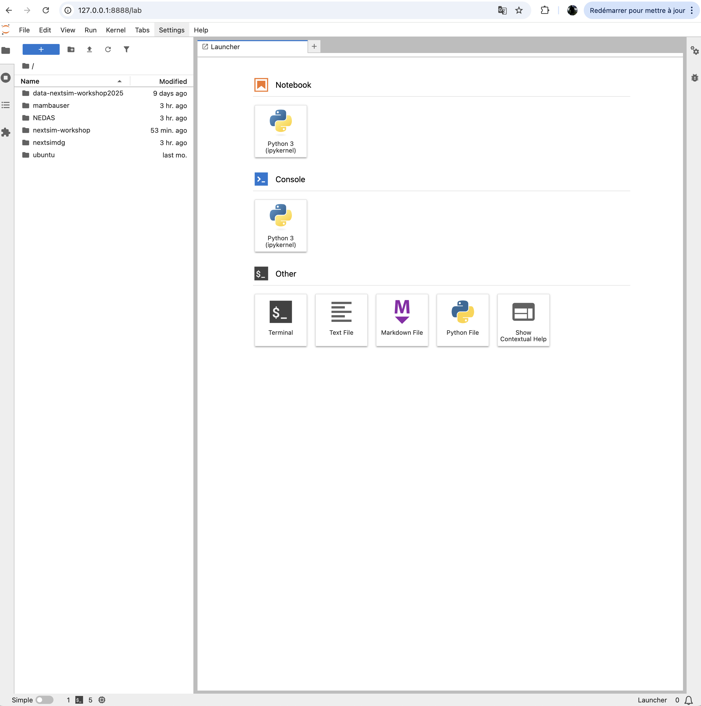

# Material for the nextsim workshop

This repo contains the material that will be displayed during neXtSIM workshop taking place in Brown University, Providence, 2025 June 26-27.
Click on the link to access the notebook corresponding to the session :

## Program

  - [Introduction to neXtSIM and use cases](nextsimdg) - Einar Olason
  - [Data assimilation in neXtSIM with NEDAS](assimilation/demo-osse.ipynb) - Yue (Michael) Ying, Ali Aydogdu, Yumeng Chen
  - [Data exploration: Antarctic neXtSIM](antarctic/README.md) - Christopher Horvat
  - [Data exploration: wave-ice coupled neXtSIM-WW3](ww3-nextsim/tutorial_ww3-nextsim.ipynb) - Guillaume Boutin
  - [Data exploration: kilometer-scale sea-ice-ocean coupled simulations with a brittle rheology](hires-bbm/README.md) - Stephanie Leroux
  - [neXtSIM: structure and design principles](nextsim-structure/README.md) - Timothy Spain
  - [Use cases run on GPU](nextsimdg-gpu/README.md) - Robert Jendersie
  - [How to implement a new parameterization in neXtSIM](nextsim-param/README.md) - Timothy Spain

## Installation

Here are the instructions on how to run this material on your own laptop.

**Prerequisites** : You will need a recent version of docker on your machine, if you do not have it already you can install it from here : https://docs.docker.com/get-started/get-docker/
You will also need around 5Gb of storage for the docker image and the data it contains

You need 2 ingredients :
  - the notebooks
  - the computing environment


**First step** : The notebooks are stored in this very repo, download them with : 

```bash
git clone https://github.com/sasip-climate/notebooks-nextsim-workshop2025.git
```

It will create a directory called `notebooks-nextsim-workshop2025`

**Second step** : The docker image contains the python libraries, a compiled version of nextsimdg and other tools and the data required to run the notebooks. It can be downloaded with this command (after having started the docker Desktop) :

```bash
docker run --rm -v /YOURPATH/notebooks-nextsim-workshop2025:/home/notebooks-nextsim-workshop2025 -p 8888:8888 quay.io/auraoupa/nextsim-workshop:215195fdbcf0 
```

where `YOURPATH` must be replaced by the absolute path on your laptop leading to the `notebooks-nextsim-workshop2025` directory created by the first step

A jupyterlab is now deployed, you just have to open in a browser the given adress `http://127.0.0.1:8888/lab?token=...` with your assigned token

## Results

You should have this jupyterlab session open in a browser :


