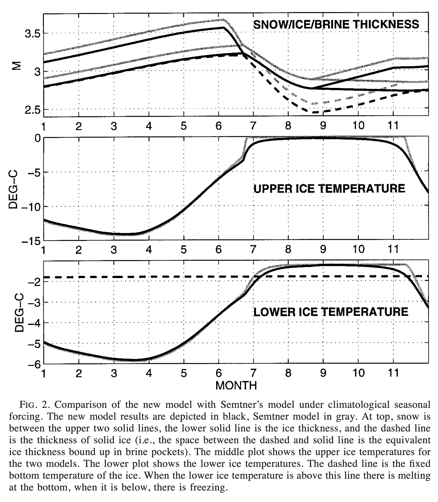

_2025 SASIP Workshop_

Introduction and demonstration session:

## Introduction to neXtSIM and use cases
Einar Ólason (NERSC, Bergen, Norway)

### What we will do in this demo session:
After a general introduction to neXtSIM, we will explore three use cases of the discontinuous Galerkin-based code under development.

### Single column thermodynamics
This use case runs the model in a single-column mode with only thermodynamics activated. It runs very fast, so the setup can be used to explore changes in seasonality due to changes in forcing, snowload, etc. It can also be used to develop new parameterisations for the column physics (see the [session on developing new parameterisations](../nextsim-param/README.md)).

(from Winton, 2000)

#### Suggested reading:

Maykut, G. A., & Untersteiner, N. (1971). Some results from a time-dependent thermodynamic model of sea ice. Journal of Geophysical Research, 76(C6), 1550–1575. [10.1029/jc076i006p01550](https://doi.org/10.1029/jc076i006p01550)

Semtner, A. J. (1976). A model for the thermodynamic growth of sea ice in numerical investigations of climate. Journal of Physical Oceanography, 6(3), 379–389. [10.1175/1520-0485(1976)006<0379:AMFTTG>2.0.CO;2](https://doi.org/10.1175/1520-0485(1976)006<0379:AMFTTG>2.0.CO;2)

Winton, M. (2000). A reformulated three-layer sea ice model. Journal of Atmospheric and Oceanic Technology, 17(4), 525–531. [10.1175/1520-0426(2000)017<0525:ARTLSI>2.0.CO;2](https://doi.org/10.1175/1520-0426(2000)017<0525:ARTLSI>2.0.CO;2)

### Idealised polynya
This case simulates a polynya forming in a semi-enclosed basin. Constant wind pushes the ice towards the shore on one side and out of the domain, opening up a coastal polynya upwind. This setup can be used to explore ice formation in open water and to develop new parameterisations for this (as we will demonstrate in the [session on developing new parameterisations](../nextsim-param/README.md)).

(from Bjornsson et al., 2001)

#### Suggested reading:

Bjornsson, H., Willmott, A. J., Mysak, L. A., & Morales Maqueda, M. A. (2001). Polynyas in a high-resolution dynamic–thermodynamic sea ice model and their parameterization using flux models. Tellus A: Dynamic Meteorology and Oceanography, 53(2), 245–265. [10.3402/tellusa.v53i2.12184](https://doi.org/10.3402/tellusa.v53i2.12184)

Ólason, E. Ö., & Harms, I. (2010). Polynyas in a dynamic-thermodynamic sea-ice model. The Cryosphere, 4(2), 147–160. [10.5194/tc-4-147-2010](https://doi.org/10.5194/tc-4-147-2010)

### Realistic 25 km resolution setup
This case demonstrates the model running in a realistic setup at medium resolution. We include it mainly for demonstration purposes, but it clearly shows areas of high deformation forming as weather systems pass over the Arctic. Despite the coarse resolution, we can identify localised bands of high shear, similar to previously published results.

(from Ólason et al., 2022)

### Suggested reading:

Ólason, E., Boutin, G., Korosov, A., Rampal, P., Williams, T., Kimmritz, M., et al. (2022). A new brittle rheology and numerical framework for large-scale sea-ice models. Journal of Advances in Modeling Earth Systems, 14(8). [10.1029/2021ms002685](https://doi.org/10.1029/2021ms002685)

